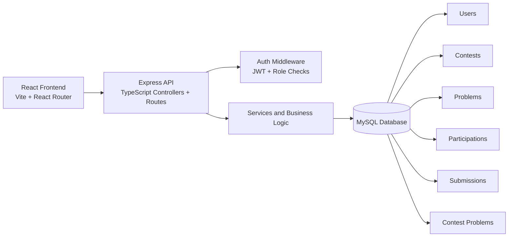

# CodeArenA

[](frontend/package.json)
[](frontend/package.json)
[](backend/package.json)
[](database/schema.sql)
[](backend/tsconfig.json)

CodeArena is a full-stack online coding contest platform built for managing programming contests, problems, participation, submissions, and live rankings through a clean React frontend and a modular Express + MySQL backend.

It is designed as a presentation-ready MVP with working authentication, role-based access control, contest workflows, user participation, submission tracking, and leaderboard aggregation.

## Product Snapshot

CodeArena focuses on the core workflow of a competitive programming platform:

- Admins can create and manage contests.
- Admins can create, update, delete, and assign problems to contests.
- Users can register, log in, join contests, and submit solutions.
- The system stores submissions and generates both contest-specific and global leaderboards.
- Dashboard statistics provide a quick overview of activity across the platform.

## Key Features

### Authentication and Roles

- JWT-based authentication
- Secure password hashing with bcrypt
- Role-based authorization for admin-only operations
- Profile and password update endpoints for authenticated users

### Contest Management

- Create, update, delete contests
- Track contest lifecycle with `UPCOMING`, `ONGOING`, and `ENDED` states
- Attach and remove problems from contests
- Prevent invalid participation and submission scenarios

### Problem Management

- Create, list, update, and delete coding problems
- Difficulty levels: `EASY`, `MEDIUM`, `HARD`
- Max-score support for each problem

### Participation and Submissions

- Users can join contests
- Submissions are accepted only for joined users
- Submissions are validated against contest status and contest-problem mapping
- Scores are capped by each problem's maximum score

### Rankings and Insights

- Global leaderboard
- Contest leaderboard
- Dashboard stats for contests, problems, submissions, and users

## Architecture



## Tech Stack

| Layer | Stack |
| --- | --- |
| Frontend | React 19, Vite, React Router, TypeScript |
| Backend | Node.js, Express, TypeScript |
| Database | MySQL |
| Auth | JWT, bcryptjs |
| Tooling | ESLint, tsx |

## Project Structure

```text
OnlineCodingContest/
├── backend/
│   ├── src/
│   │   ├── config/
│   │   ├── controllers/
│   │   ├── middleware/
│   │   ├── routes/
│   │   ├── services/
│   │   ├── types/
│   │   └── utils/
│   ├── database.js
│   └── seed.js
├── database/
│   ├── schema.sql
│   ├── procedures.sql
│   └── seed.sql
├── frontend/
│   └── src/
│       ├── api/
│       ├── components/
│       └── pages/
├── db_assignment.sql
└── Chapter3_Report.md
```

## Database Model

The application uses six core tables:

- `users`
- `contests`
- `problems`
- `contest_problems`
- `participations`
- `submissions`

Relationships:

- A contest can contain many problems.
- A user can join many contests.
- A user can submit solutions for contest problems.
- Leaderboards are computed from submission aggregates.

## Setup Guide

### Prerequisites

- Node.js 18+
- npm
- MySQL Server running locally

### 1. Clone the repository

```bash
git clone <your-repo-url>
cd OnlineCodingContest
```

### 2. Configure environment variables

Create a `.env` file inside `backend/`:

```env
DB_HOST=localhost
DB_USER=root
DB_PASSWORD=your_mysql_password
JWT_SECRET=your_super_secret_jwt_key
PORT=5001
```

### 3. Install dependencies

```bash
cd backend
npm install

cd ../frontend
npm install
```

### 4. Initialize the database

Option A: Bootstrap schema and sample data in one flow

```bash
cd backend
npm run setup
```

Option B: Start the API and seed separately

```bash
cd backend
npm run dev
```

In another terminal:

```bash
cd backend
npm run seed
```

### 5. Start the frontend

```bash
cd frontend
npm run dev
```

### 6. Open the app

- Frontend: `http://localhost:5173`
- Backend API: `http://localhost:5001`

## Seeded Demo Accounts

These accounts are inserted by the seed script:

| Role | Email | Password |
| --- | --- | --- |
| Admin | `admin@codearena.com` | `admin123` |
| User | `sayan@codearena.com` | `user123` |
| User | `alice@codearena.com` | `user123` |
| User | `bob@codearena.com` | `user123` |
| User | `charlie@codearena.com` | `user123` |

## Frontend Experience

The frontend includes:

- Login and registration pages
- Dashboard with platform statistics
- Contest listing with join actions
- Problem listing and problem detail view
- Submission form with language selection
- Leaderboard view

## Backend API Overview

### Auth

| Method | Endpoint | Description |
| --- | --- | --- |
| `POST` | `/api/auth/register` | Register a new user |
| `POST` | `/api/auth/login` | Log in and receive JWT |
| `GET` | `/api/auth/me` | Get current user |
| `PUT` | `/api/auth/me` | Update current profile |
| `PUT` | `/api/auth/me/password` | Change password |
| `GET` | `/api/auth/users` | List users, admin only |

### Users

| Method | Endpoint | Description |
| --- | --- | --- |
| `GET` | `/api/users` | List users, admin only |

### Contests

| Method | Endpoint | Description |
| --- | --- | --- |
| `GET` | `/api/contests` | List contests |
| `GET` | `/api/contests/:id` | Get contest by id |
| `POST` | `/api/contests` | Create contest, admin only |
| `PUT` | `/api/contests/:id` | Update contest, admin only |
| `DELETE` | `/api/contests/:id` | Delete contest, admin only |
| `GET` | `/api/contests/:id/problems` | Get problems in a contest |
| `POST` | `/api/contests/:id/problems` | Assign problem to contest, admin only |
| `DELETE` | `/api/contests/:id/problems/:problemId` | Remove problem from contest, admin only |

### Problems

| Method | Endpoint | Description |
| --- | --- | --- |
| `GET` | `/api/problems` | List all problems |
| `GET` | `/api/problems/:id` | Get problem by id |
| `POST` | `/api/problems` | Create problem, admin only |
| `PUT` | `/api/problems/:id` | Update problem, admin only |
| `DELETE` | `/api/problems/:id` | Delete problem, admin only |

### Participation and Submissions

| Method | Endpoint | Description |
| --- | --- | --- |
| `GET` | `/api/submissions` | List submissions |
| `POST` | `/api/submissions` | Submit solution, authenticated |
| `GET` | `/api/submissions/participations` | List participations |
| `POST` | `/api/submissions/participations` | Join contest, authenticated |

### Leaderboard and Dashboard

| Method | Endpoint | Description |
| ---   | ---                           | ---                 |
| `GET` | `/api/leaderboard`            | Global leaderboard  |
| `GET` | `/api/leaderboard/:contestId` | Contest leaderboard |
| `GET` | `/api/dashboard/stats`        | Platform statistics |

## Validation and Business Rules

The backend enforces several rules that make the workflow consistent:

- A user must join a contest before submitting.
- Submissions are rejected for ended contests.
- Problems must belong to the selected contest.
- Scores are bounded by the configured `max_score`.
- Admin-only actions are protected via JWT and role checks.

## Scripts

### Backend

```bash
npm run dev      # start backend in watch mode
npm run start    # start backend once
npm run seed     # seed sample data
npm run setup    # initialize database and seed data
```

### Frontend

```bash
npm run dev      # start Vite dev server
npm run build    # production build
npm run preview  # preview built app
npm run lint     # run ESLint
```

## Current Scope

CodeArena is a strong MVP. It covers the complete management flow for contests, problems, users, submissions, and rankings.

What it does not yet include:

- Real code execution and sandboxed judging
- Test-case based evaluation engine
- Multi-language runtime containers
- Pagination and advanced filtering UI
- Production deployment configuration

The current submission flow stores code and score, which is suitable for demonstration, architecture review, and academic/project evaluation.

## Why This Project Stands Out

CodeArena is more than a CRUD dashboard. It models an actual contest workflow with state transitions, role boundaries, relational data integrity, and leaderboard computation. That gives it stronger system-design value than a basic full-stack template while still remaining practical to run and present locally.
